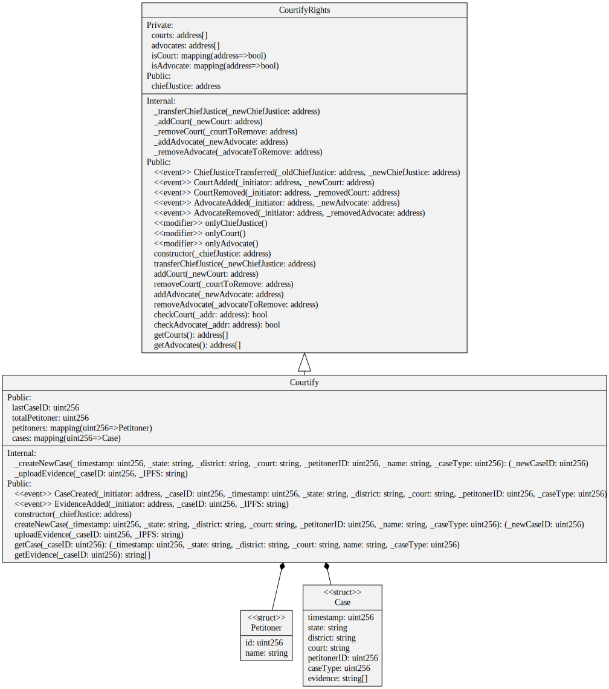

# Courtify Smart Contract Repo

This repository contains all the relevant required smart contracts for the Cortify system to work.

## Badges

Version & Tag:

Issue & PR:

CI & Code Coverage:

Metrics & Activity:

## Description

Courtify smart contracts have mainly two parts. One is the access contract, which defines granular access to the Courtify main smart contract. And the courtify smart contract which takes in cases, and provides a decentralized and public view of our courts and cases (where deemed necessary).

## UML Diagram

## Deployment

- [Polygon Mumbai Testnet](https://mumbai.polygonscan.com/address/0x3180e17578ECca94976005904574E4Daa79D6935#code) (Verified)

## Assumptions

- Chief Justice won't be a bad character. (Though an easy way is to have a multisig as the Chief Justice Wallet.)

## Improvements

- Gas Optimization can be done through saving most values as `uint256` instead of `string` and parsing the same in Frontend.
